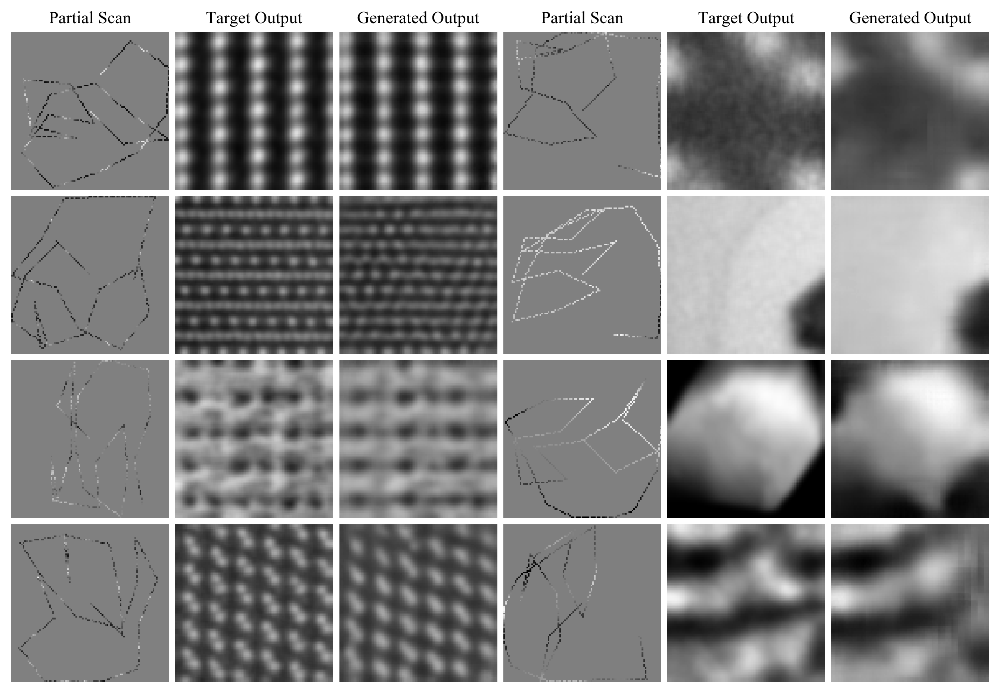

# Adaptive Partial STEM

This repository is for the preprint|paper "Adaptive Partial Scanning Transmission Electron Microscopy with Reinforcement Learning". It contains TensorFlow code to train recurrent actors and critics to cooperate with a convolutional generator to complete partial scans. 

  

Examples show test set 1/23.04 px coverage adaptive partial scans, target outputs and generated partial scan completions for 96x96 crops from STEM images.

Important not: Add empty `__init__.py` files to `dnc` subdirectories to run code.

## Pretrained Models

Checkpoints for fully trained models are [here](https://drive.google.com/drive/folders/1LJuaVXEvlfhrZLQiz_LEnoAn59WM2PpI?usp=sharing). They are for experiments 125 (LSTM), 126 (Spirals), and 127 (DNC) after 500k and 1000k training iterations. 

To load the models, change the save location in the `checkpoint` file to your save location.

## Training Data

Datasets containing 19769 STEM images cropped or downsampled to 96x96 are [here](https://github.com/Jeffrey-Ede/datasets/wiki).

## Misc Contents

The front page has support vector graphiscs and python scripts used to create examples. In addition, `read_loss_log.py` is helpful to read loss logs output during training.

## Contact

Jeffrey Ede: j.m.ede@warwick.ac.uk
